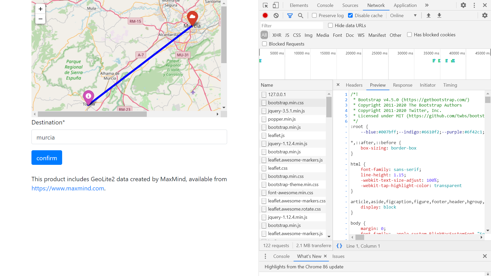

# :zap: Python Django Distance

* Python-Django app using the [Python Folium library](https://pypi.org/project/folium/) and [MaxMind GeoLite2 data](https://dev.maxmind.com/geoip/geoip2/geolite2/) to display user location and line-of sight distance to another user-selected location.
* Code from a 3-part tutorial by [Pyplane](https://www.youtube.com/channel/UCQtHyVB4O4Nwy1ff5qQnyRw)- see [:clap: Inspiration](#clap-inspiration) below.

## :page_facing_up: Table of contents

* [:zap: Python Django Distance](#zap-python-django-distance)
	* [:page_facing_up: Table of contents](#page_facing_up-table-of-contents)
	* [:books: General info](#books-general-info)
	* [:camera: Screenshots](#camera-screenshots)
	* [:signal_strength: Technologies](#signal_strength-technologies)
	* [:floppy_disk: Setup](#floppy_disk-setup)
	* [:computer: Code Examples](#computer-code-examples)
	* [:cool: Features](#cool-features)
	* [:clipboard: Status & To-do list](#clipboard-status--to-do-list)
	* [:clap: Inspiration](#clap-inspiration)
	* [:envelope: Contact](#envelope-contact)

## :books: General info

* Django framework: used to tba
* [Bootstrap starter template](https://getbootstrap.com/docs/4.5/getting-started/introduction/) used in `python_django_distance/templates/base.html`
* [Bootstrap demo modal](https://getbootstrap.com/docs/4.5/getting-started/introduction/) used in `measurements/templates/main.html`

## :camera: Screenshots



## :signal_strength: Technologies

* [Python v3](https://www.python.org/) programming language
* [Django v3](https://www.djangoproject.com/) server-side web framework
* [Bootstrap v4](https://getbootstrap.com/) responsive components.
* [Django Crispy Forms](https://django-crispy-forms.readthedocs.io/en/latest/#) to control the rendering behavior of your Django forms
* [geopy v2](https://pypi.org/project/geopy/) Python Geocoding Toolbox
* [geoip2 v2](https://pypi.org/project/geoip2/) MaxMind GeoIP2 API
* [MaxMind GeoLite2 Free Downloadable Databases](https://dev.maxmind.com/geoip/geoip2/geolite2/)
* [Python library Folium v0.11.0](https://pypi.org/project/folium/) used with the Python ecosystem and the mapping strengths of the Leaflet.js library.

## :floppy_disk: Setup

* [Install Python](https://docs.python-guide.org/starting/installation/)
* [Install pip](https://docs.python-guide.org/dev/virtualenvs/#installing-pipenv)
* [Install Django](https://docs.djangoproject.com/en/3.1/howto/windows/) by typing `pip install Django`
* [Install geopy](https://pypi.org/project/geopy/) by typing `pip install geopy`
* [Install geoip2 v2](https://pypi.org/project/geoip2/) by typing `pip install geoip2`
* [Install country & city databases from Maxmind](https://www.maxmind.com/en/home) - create an account then login and download GeoLite2 City and GeoLite2 Country GZIP files then unpack (I used the free 7-zip tool). You will get 2 GeoIP2 binaries (.mmdb) files
* [Install Folium](https://pypi.org/project/folium/) by typing `pip install folium`
* Run `django-admin startproject mysite` to create a new project [ref. docs](https://docs.djangoproject.com/en/3.1/intro/tutorial01/)
* Add code
* Run `python manage.py makemigrations`
* Run `python manage.py runserver` to run server on port 8000
* Note: I had to add my own IP address as a variable in `measurements/views.py` as the helper function just returned a network IP address `127.0.0.1` which not give coordinates for the map database.

## :computer: Code Examples

* extract from tba

```python
)
```

## :cool: Features

* tba

## :clipboard: Status & To-do list

* Status: Working
* To-do: Add code add commenting

## :clap: Inspiration

* [How to build a GeoDjango app | How to build a GeoDjango app | Learn Django GeoLocation with Folium (Part 1/3))](https://www.youtube.com/watch?v=_KIMevaubfQ)
* [How to build a GeoDjango app | Learn Django GeoLocation with Folium (Part 2/3)](https://www.youtube.com/watch?v=MOKEB3EjP3Y)
* [How to build a GeoDjango app | Learn Django GeoLocation with Folium (Part 3/3)](https://www.youtube.com/watch?v=8mCGYhQ5azg)
* [stackOverflow: How do I get user IP address in Django?](https://stackoverflow.com/questions/4581789/how-do-i-get-user-ip-address-in-django)

## :envelope: Contact

* Repo created by [ABateman](https://www.andrewbateman.org) - you are welcome to [send me a message](https://andrewbateman.org/contact)
